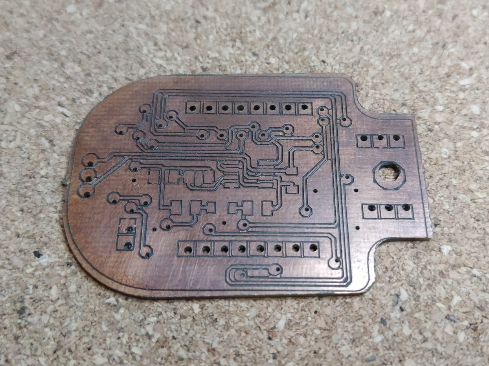
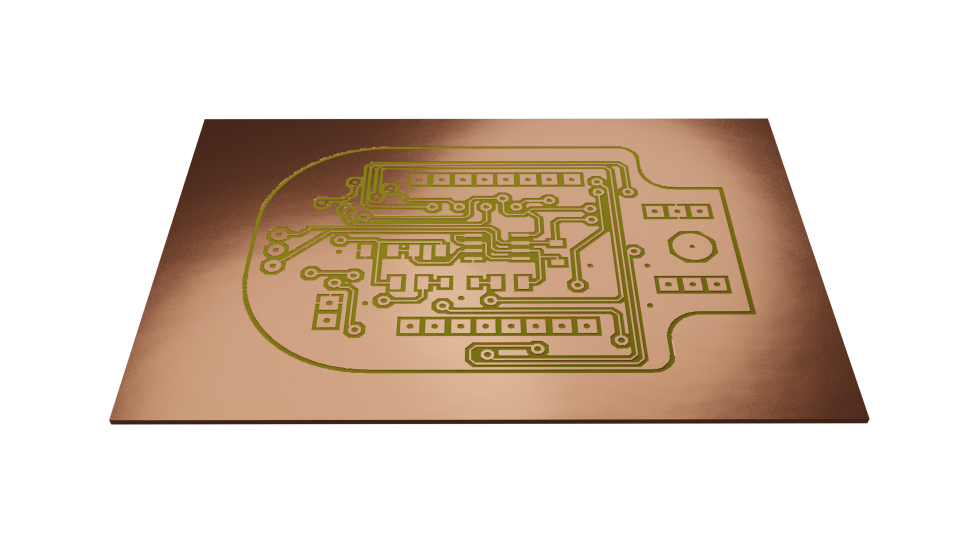
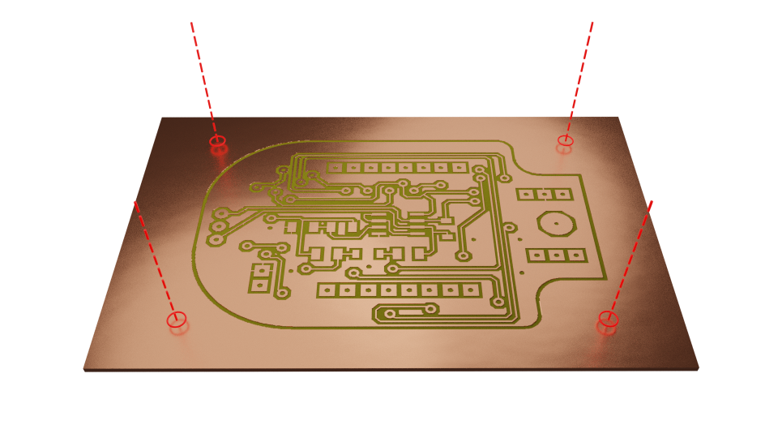
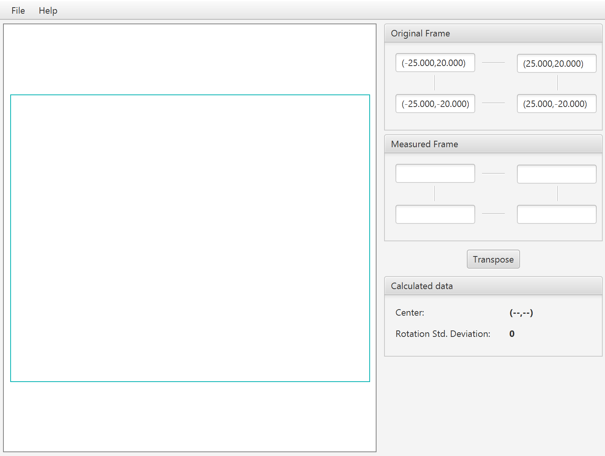
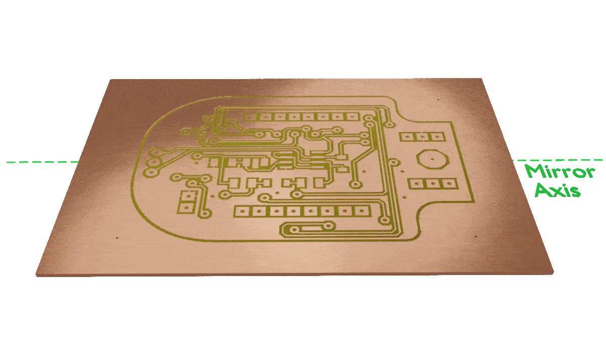
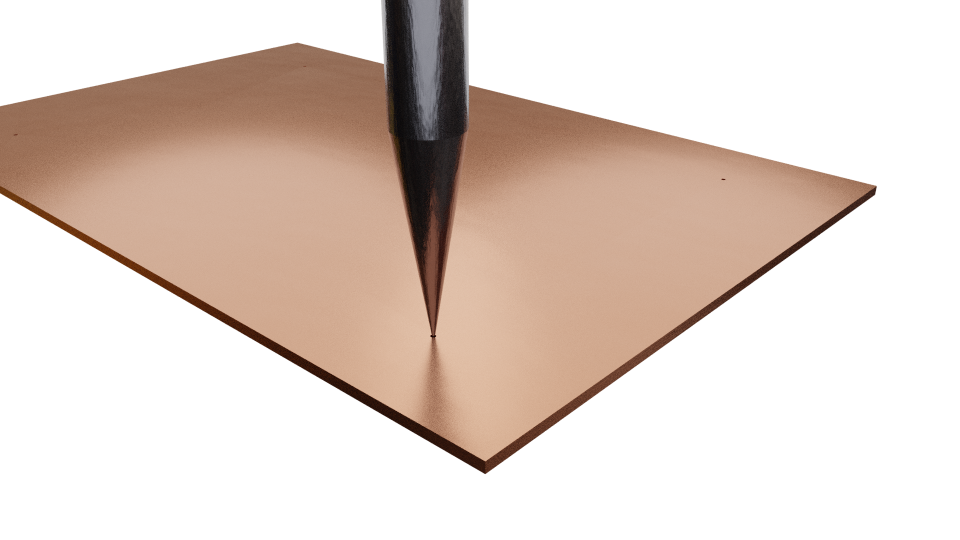
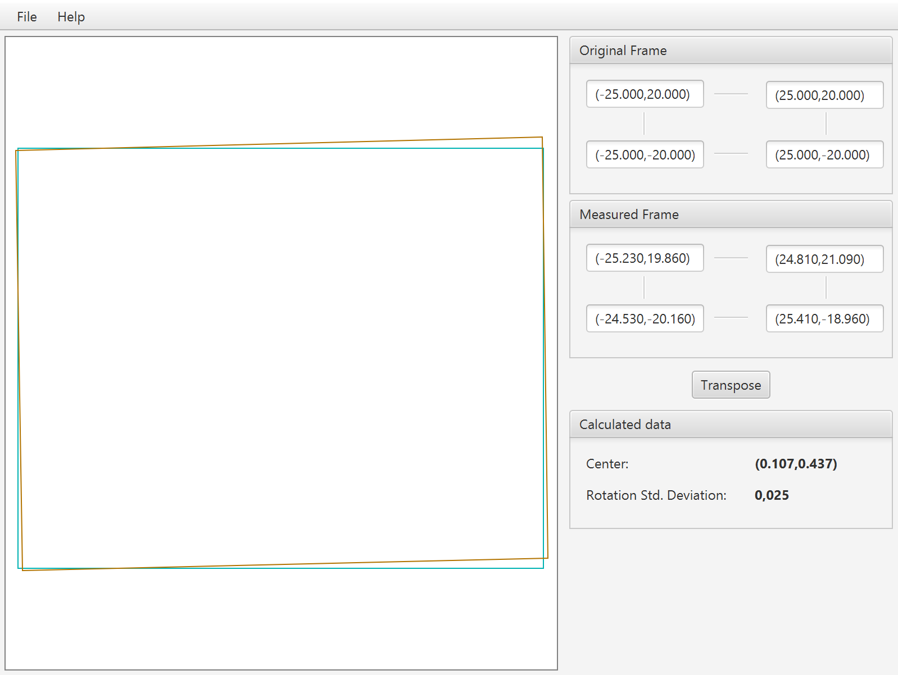

## Why do I need a Double-Sided PCB Alignment Tool?

When building double-sided PCBs, turning the board and aligning the other side can be a process that is prone to error. This may end up in misaligned holes like the ones in the following image:

Mechanical alignment systems may induce errors above 300-400um, enough to ruin the whole process. By simply drilling a few reference holes and performing a visual alignment we can achieve excellent results. This is done with the help of this software which transposes the G-CODE programs based on the visual measures. 

## How to use the software

* **Step1: Isolate the Top Copper**

    Isolate the Top Copper tracks as shown in the following image.
    
    

* **Step2: Drill the alignment holes**

    Drill 4 holes following a square or rectangular pattern outside the board edge. 
    
    
    
    **NOTE:** Try to drill small holes (<0.4mm). The smaller the hole the more accurate the calibration in the following steps. 
    
* **Step 3: Register the holes in the tool**

    Insert each hole position in the "Original Frame" form:
    
    

* **Step4: Turn the board**

    Turn the board around the mirroring axis.
    
    

* **Step5: Check new hole positions**

    After turning the board, the holes will be slightly out of the reference coordinates. This is due to rotation/displacement of the board during the manipulation and imperfections in the board edges. 
    
    

    Align the drill with the center of each hole and register the measured position into the "Measured Frame" form:
    
    
    
    **NOTE:** A visual alignment is enough to achieve an almost perfect result. However, the alignment must be performed with care, moving the tool with small increments until the desired alignment is reached.
    
    The software will calculate the Rotation Standard Deviation. This number indicates the deviation of the measured frame from the original shape. Values lower than 0.050 degrees are acceptable. Values higher than 0.050 degrees indicate an incorrect measured frame.  
     
* **Step6: Load de GCODE into the software**
    
    Load the G-CODE program into the software and click **Transpose**. A new G-CODE program will be calculated which matches the measured holes.
    
    
    
    **NOTE:** The G-CODE programs must be already mirrored around the desired mirroring axis. 
    
* **Step7: Export and isolate the bottom copper**

    Export the new G-CODE program by clicking _File -> Save As..._ and isolate the bottom copper tracks. 
    
    Repeat steps 6 and 7 with all the G-CODE programs that should be transposed in this layer such as soldermask, silkscreen, drill holes, etc. 
    
## How to run the software

* **Windows**

    Download the latest binaries (x86 or x64) from the [Releases Section](https://github.com/alvarogimenez/g-code-utils/releases)
    
* **Linux/Mac**

    - Install JRE (Version 8 or higher) from [Java Download Page](http://java.com/download)
    - Download the _JAR_ file from the [Releases Section](https://github.com/alvarogimenez/g-code-utils/releases)
    - Run the software by executing the following command on a terminal:
    
        `java -jar g-code-utils-*.jar`